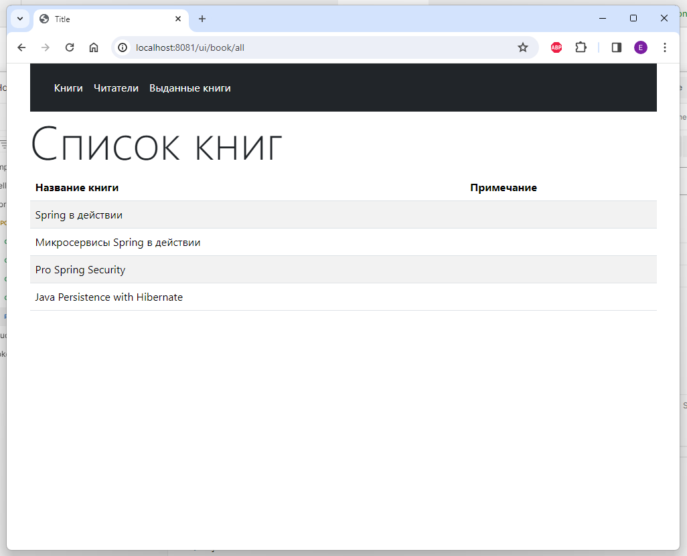
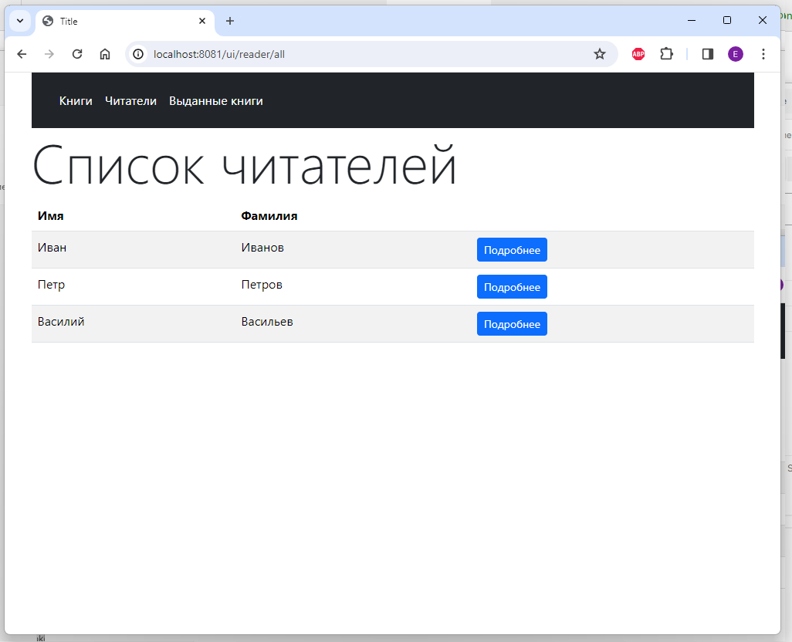
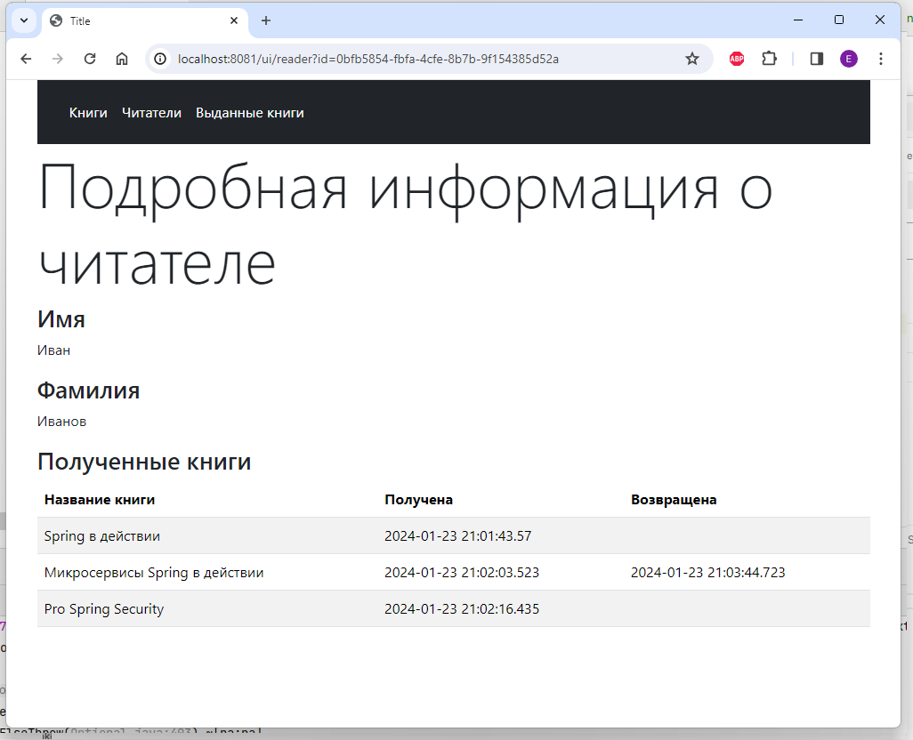
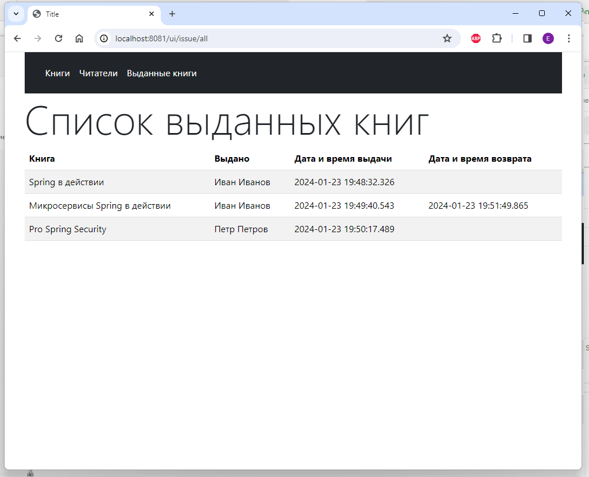

# Library application
## Задание

1. В предыдущий проект (где была библиотека с книгами, выдачами и читателями) добавить следующие рерурсы,
которые возвращают готовые HTML-страницы (т.е. это просто Controller'ы):  
1.1. /ui/books - на странице должен отобразиться список всех доступных книг в системе  
1.2 /ui/reader - аналогично 1.1  
1.3 /ui/issues - на странице отображается таблица, в которой есть столбцы (книга, читатель, когда взял, когда вернул (если не вернул - пустая ячейка)).  
1.4* /ui/reader/{id} - страница, где написано имя читателя с идентификатором id и перечислены книги, которые на руках у этого читателя
 
## Решение
Отображение списка книг  

Отображение списка читателей

По кнопке "Подробнее" можно посмотреть детальную информацию по читателю

Также отображается информация по всем выданным книгам

