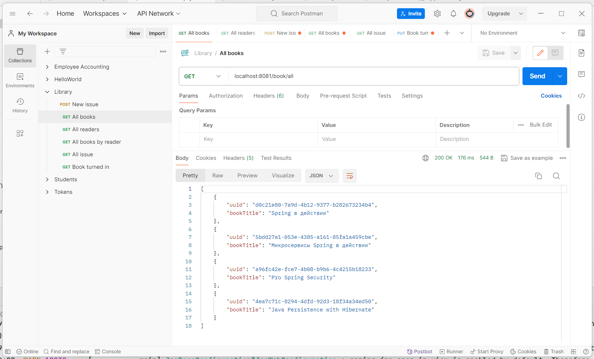
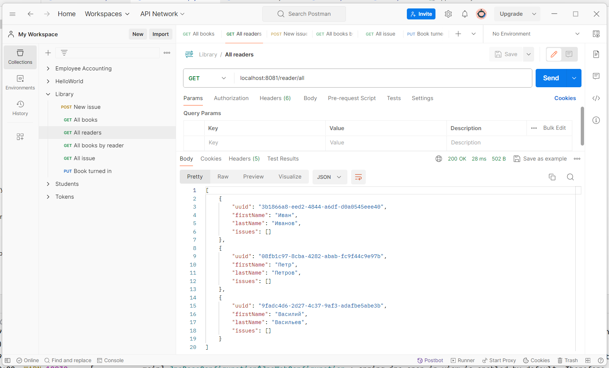
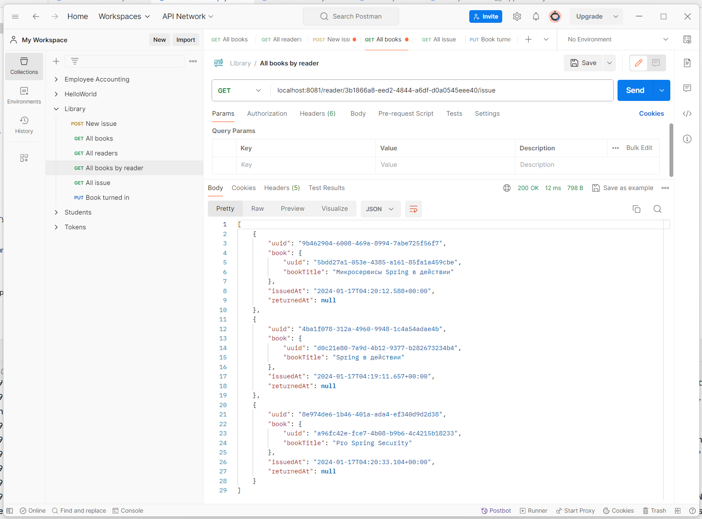
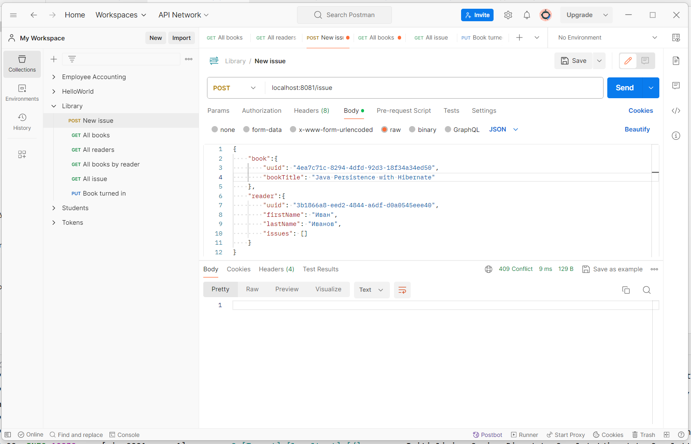
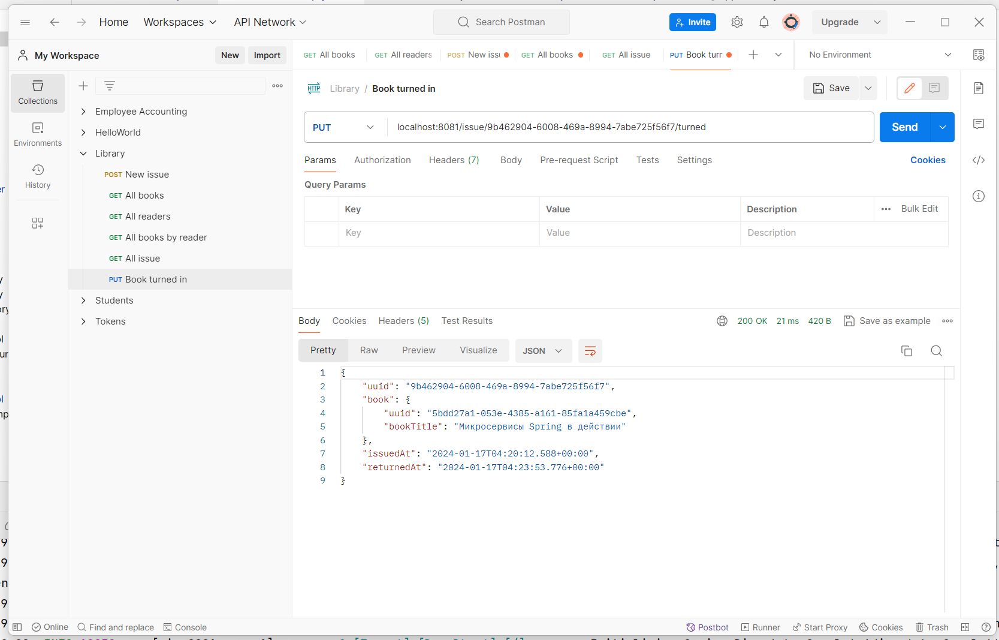
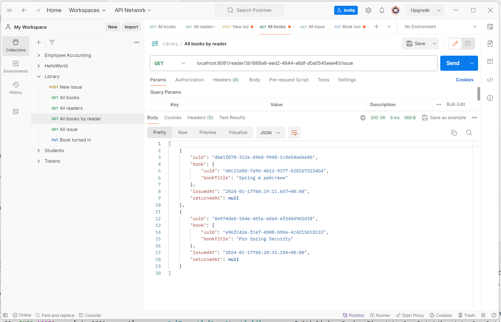

# Library application
## Задание
0. Переварить все, что было изучано.
1. Доделать сервис управления книгами:
  * 1.1 Реализовать контроллер по управлению книгами с ручками: GET /book/{id} - получить описание книги, DELETE /book/{id} - удалить книгу, POST /book - создать книгу
  * 1.2 Реализовать контроллер по управлению читателями (аналогично контроллеру с книгами из 1.1)
  * 1.3 В контроллере IssueController добавить ресурс GET /issue/{id} - получить описание факта выдачи
2. Issue
  * 2.1 В сервис IssueService добавить проверку, что у пользователя на руках нет книг. Если есть - не выдавать книгу (статус ответа - 409 Conflict)
  * 2.2 В сервис читателя добавить ручку GET /reader/{id}/issue - вернуть список всех выдачей для данного читателя
3. Additionally
  * 3.1* В Issue поле timestamp разбить на 2: issued_at, returned_at - дата выдачи и дата возврата
  * 3.2* К ресурс POST /issue добавить запрос PUT /issue/{issueId}, который закрывает факт выдачи. (т.е. проставляет returned_at в Issue).
  * Замечание: возвращенные книги НЕ нужно учитывать при 2.1
  * 3.3** Пункт 2.1 расширить параметром, сколько книг может быть на руках у пользователя.
  * Должно задаваться в конфигурации (параметр application.issue.max-allowed-books). Если параметр не задан - то использовать значение 1.

## Решение
Сущности:  

`Book.java`
```java
@Data
@NoArgsConstructor
@Entity
public class Book implements Serializable {
    @Id
    @GeneratedValue
    private UUID uuid;

    private String bookTitle;

    public Book(String bookTitle) {
        this.bookTitle = bookTitle;
    }
}
```
`Reader.java`
```java
@Data
@NoArgsConstructor
@Entity
public class Reader implements Serializable {
    @Id
    @GeneratedValue
    private UUID uuid;

    private String firstName;
    private String lastName;

    @OneToMany(mappedBy = "reader", cascade = CascadeType.ALL)
    @JsonManagedReference
    private Set<Issue> issues = new HashSet<>();

    public void addIssue(Issue issue) {
        issues.add(issue);
        issue.setReader(this);
    }

    public void removeIssue(Issue issue) {
        issues.remove(issue);
        issue.setReader(null);
    }

    public Reader(String firstName, String lastName) {
        this.firstName = firstName;
        this.lastName = lastName;
    }
}
```
`Issue.java`
```java
@Data
@Entity
public class Issue implements Serializable {
    @Id
    @GeneratedValue
    private UUID uuid;

    @ManyToOne
    @JoinColumn(name = "book_uuid", nullable = false)
    private Book book;

    @ManyToOne
    @JsonBackReference
    private Reader reader;

    /* 3.1* В Issue поле timestamp разбить на 2: issued_at, returned_at - 
    дата выдачи и дата возврата */
    // Дата выдачи книги
    @Temporal(TemporalType.TIMESTAMP)
    @Column(updatable = false)
    @org.hibernate.annotations.CreationTimestamp
    private Date issuedAt;

    // Дата возврата книги
    private Date returnedAt;

    @Override
    public boolean equals(Object o) {
        if (this == o) {
            return true;
        }
        if (o == null || getClass() != o.getClass()) {
            return false;
        }
        Issue r = (Issue) o;
        return Objects.equals(uuid, r.getUuid());
    }

    @Override
    public int hashCode() {
        return Objects.hash(uuid);
    }
}
```
Сущность Issue связана отношениями:
* ManyToOne к Book
* двунаправленной связью ManyToOne и OneToMany к Reader. Отношение OneToMany 
позволит выполнить запрос всех взятых книг для читателя (2.2 В сервис читателя 
добавить ручку GET /reader/{id}/issue - вернуть список всех выдачей для данного 
читателя).

Управление CRUD для Book, Reader выполняется с помощью сервисов - реализаций 
интерфейса IService. 

Первоначальное наполнение БД реализуется при помощи CommandLineRunner.

Все книги:



Все читатели:



Создание новой выдачи:


Иванов получил три книги:



Ограничение по количеству выдаваемых книг:

`application.yml`
```yaml
application:
  issue:
    max-allowed-books: 3
```
`IssueServiceImpl.java`
```java
/* Должно задаваться в конфигурации (параметр application.issue.max-allowed-books).
     * Если параметр не задан - то использовать значение 1
     */
    @Value("${application.issue.max-allowed-books}")
    private int MAX_ALLOWED_BOOKS = 1;
```
При получении четвертой:



Возвращаем книгу:



Все оставшиеся книги читателя:

