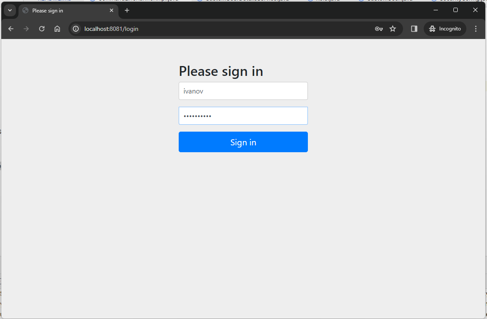
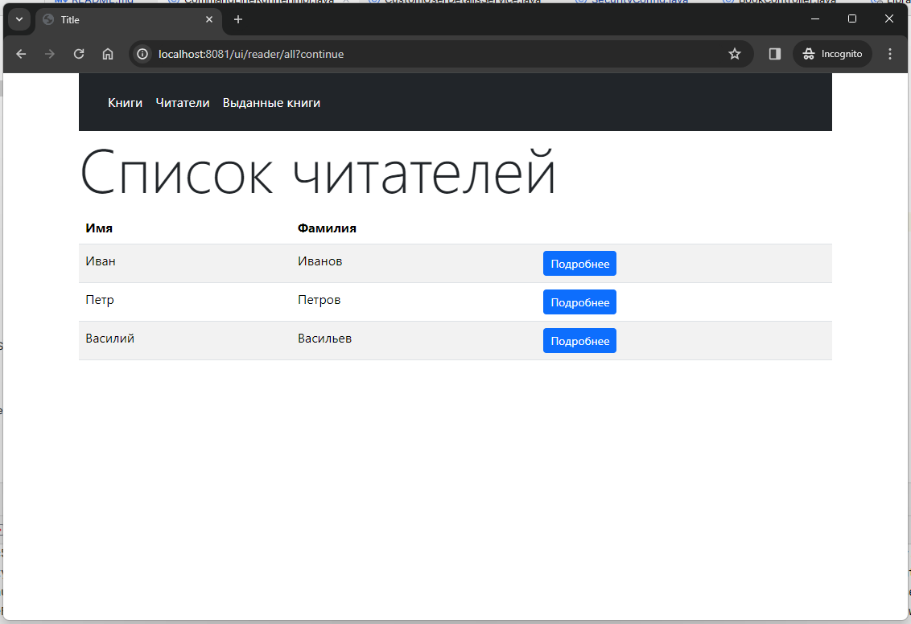
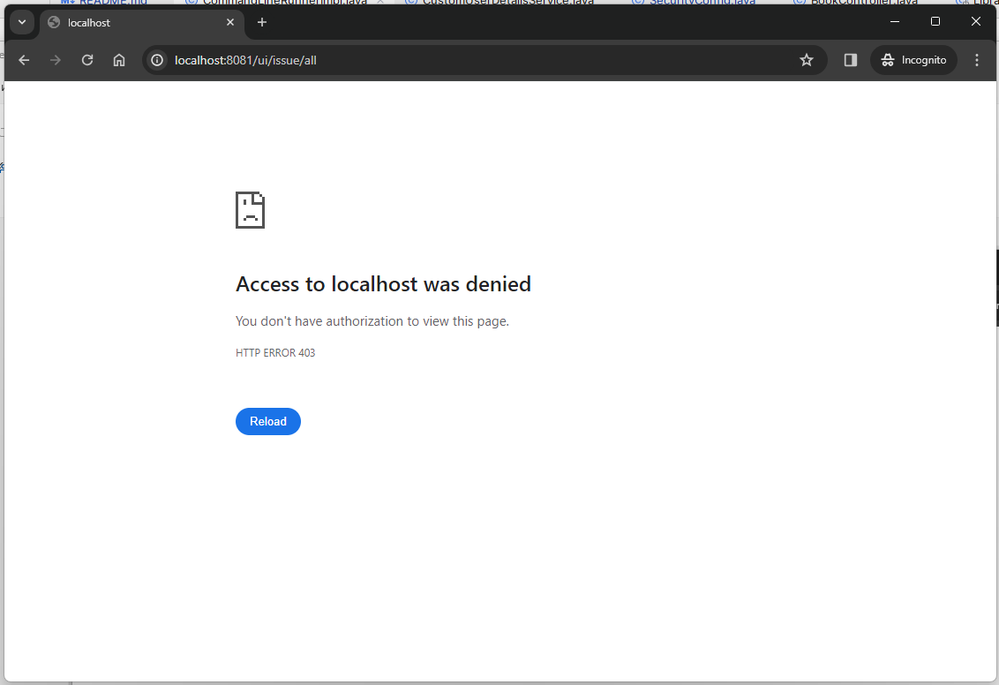

# Library application
## Задание
1.1. Для ресурсов, возвращающих HTML-страницы, реализовать авторизацию через login-форму.  
   Остальные /api ресурсы, возвращающие JSON, закрывать не нужно!  
2.1. * Реализовать таблицы User(id, name, password) и Role(id, name), связанные многие ко многим  
2.2. * Реализовать UserDetailsService, который предоставляет данные из БД (таблицы User и Role)  
3.3. * Ресурсы выдачей (issue) доступны обладателям роли admin  
3.4. * Ресурсы читателей (reader) доступны всем обладателям роли reader  
3.5. * Ресурсы книг (books) доступны всем авторизованным пользователям  

## Решение

### Сущности User, Role

`CustomUser.java`
```java
@Data
@NoArgsConstructor
@Entity
@Table(name = "custom_user")
public class CustomUser implements Serializable {
    @Id
    @GeneratedValue
    private UUID uuid;

    @Column(name = "user_login")
    private String userLogin;
    private String password;

    @ManyToMany(fetch = FetchType.EAGER)
    @JoinTable(
            name = "user_role",
            joinColumns = @JoinColumn(name = "custom_user_uuid"),
            inverseJoinColumns = @JoinColumn(name = "role_uuid")
    )
    private List<Role> roles = new ArrayList<>();
}
```
`Role.java`
```java
@Data
@NoArgsConstructor
@Entity
@Table(name = "role")
public class Role implements Serializable {
    @Id
    @GeneratedValue
    private UUID uuid;

    @Column(name = "role_title")
    private String roleTitle;

    public Role(String title) {
        this.roleTitle = title;
    }
}
```
Для User, Role также выполнены репозитории, сервисы

### Реализация UserDetailsService
`CustomUserDetailsService.java`
```java
@Service
public class CustomUserDetailsService implements UserDetailsService {

    private final UserService userService;

    @Autowired
    public CustomUserDetailsService(UserService userService) {
        this.userService = userService;
    }

    @Override
    public UserDetails loadUserByUsername(String username) {
        /* Находим пользователя в репозитории */
        CustomUser user = userService
                .findByUserLogin(username)
                .orElseThrow(() -> new UsernameNotFoundException("Username not found"));
        /* Возвращаем UserDetails для пользователя */
        return User.builder()
                .username(user.getUserLogin())
                .password(user.getPassword())
                .authorities(user
                        .getRoles()
                        .stream()
                        .map(role -> new SimpleGrantedAuthority(role.getRoleTitle()))
                        .toList())
                .build();
    }
}
```
### Определение прав доступа для ролей
`SecurityConfig.java`
```java
@Configuration
@EnableWebSecurity
public class SecurityConfig {
   @Bean
   public SecurityFilterChain filterChain(HttpSecurity http) throws Exception {
      http
              .authorizeHttpRequests((auth) -> auth
                      .requestMatchers("/api/v1/**").permitAll()
                      // 3.3* Ресурсы выдачей (issue) доступны обладателям роли admin
                      .requestMatchers("/ui/issue/**").hasAuthority("admin")
                      /* 3.4* Ресурсы читателей (reader) доступны всем обладателям роли reader
                       !! добавлен админ к заданию */
                      .requestMatchers("/ui/reader/**").hasAnyAuthority("reader", "admin")
                      // 3.5* Ресурсы книг (books) доступны всем авторизованным пользователям
                      .requestMatchers("/ui/book/**").authenticated()
                      .anyRequest().denyAll())
              .formLogin(Customizer.withDefaults())
              .csrf((csrf) -> csrf.ignoringRequestMatchers("/api/v1/**"));
      return http.build();
   }
}
```
### Создаем роли reader, admin, пользователей
`CommandLineRunnerImpl.java`
```java
 List<Role> roles = new ArrayList<>(Arrays.asList(
                new Role("admin"),
                new Role("reader")
        ));

...
        
        roles.forEach(roleService::save);

        /* Читатель */
        CustomUser ivanov = new CustomUser();
        ivanov.setUserLogin("ivanov");
        ivanov.setPassword(getPasswordEncoder().encode("readerPass"));
        ivanov.getRoles().add(roleService.findFirstByRoleTitle("reader").get());
        userService.save(ivanov);

        /* Админ */
        CustomUser sidorov = new CustomUser();
        sidorov.setUserLogin("sidorov");
        sidorov.setPassword(getPasswordEncoder().encode("adminPass"));
        sidorov.getRoles().add(roleService.findFirstByRoleTitle("admin").get());
        userService.save(sidorov);
    }

    private PasswordEncoder getPasswordEncoder() {
        return PasswordEncoderFactories.createDelegatingPasswordEncoder();
    }
```
### ivanov login (reader)


reader-у доступны список книг


и страницы читателей



не доступна страница выдачи



### sidorov login (admin)

Доступны все разделы включая выдачи

